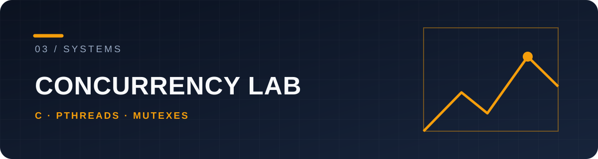

# philosophers

A C and pthreads simulation of the dining philosophers problem. Each philosopher is a thread, each fork is a mutex, and a monitor checks meal timing and termination.

## The concurrency problem

Adjacent philosophers share forks. Acquiring those resources without coordination can deadlock; reading shared state without synchronization can race. The implementation organizes fork access, state updates and time-based monitoring in separate functions.

```text
think → acquire forks → eat → release forks → sleep → repeat
                      ↑
               monitor deadlines
```

## Build and run

```sh
make
./philo 5 800 200 200
./philo 5 800 200 200 7
```

Arguments are philosopher count, time to die, time to eat, time to sleep, and optionally a required meal count. Times are in milliseconds. A single philosopher cannot acquire two forks and provides an important edge case.

| File | Role |
| --- | --- |
| [`philo_life.c`](philo_life.c) | Philosopher routine |
| [`monitor.c`](monitor.c) | Stop/death checks |
| [`init.c`](init.c) | Initialization |
| [`cleanup.c`](cleanup.c) | Resource release |

The program illustrates synchronization and timing tradeoffs; scheduling outcomes depend on the host and chosen timings. Part of the 42 curriculum.
